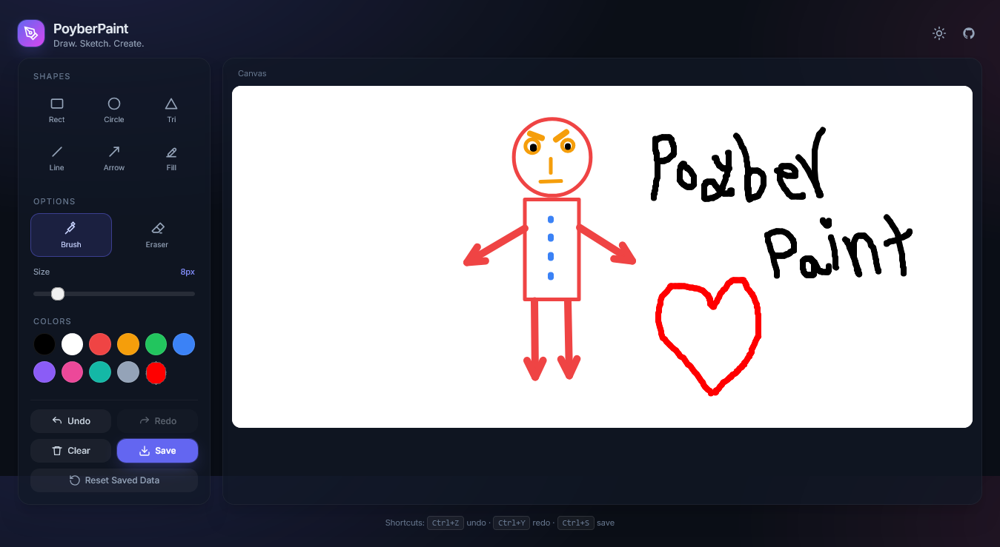
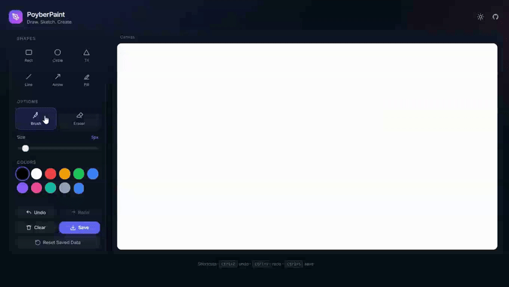

<div align="center">



<br />
<br />

# 🎨 PoyberPaint

**A modern, lightweight paint & drawing web app — right in your browser.**

Draw. Sketch. Create.

<br />

[](https://ashkanpoyber.github.io/PoyberPaint/)
[](https://developer.mozilla.org/en-US/docs/Web/JavaScript)
[](https://tailwindcss.com/)
[](./LICENSE)
[](https://github.com/ashkanpoyber/PoyberPaint/stargazers)

</div>

---

## ✨ Features

<table>
<tr>
<td width="50%">

### 🎨 Drawing

- 🖌️ **Brush & Eraser** — smooth freehand drawing
- 📏 **Line & Arrow** — with dynamic arrowheads
- 🔷 **Shapes** — rectangle, circle, triangle
- 🎯 **Adjustable size** — from 1px to 60px
- 🎨 **Color palette** — 10 presets + custom picker

</td>
<td width="50%">

### ⚡ Experience

- ↩️ **Undo / Redo** — with `Ctrl+Z` / `Ctrl+Y`
- 💾 **Export PNG** — one click, `Ctrl+S`
- 🌗 **Light / Dark theme** — auto-saved
- 💽 **Auto-save** — persists across reloads
- 📱 **Fully responsive** — works on any screen
- 🖱️ **Pointer Events** — mouse, touch, stylus
- 🖥️ **Retina-ready** — crisp on high-DPI

</td>
</tr>
</table>

---

## 🎬 Demo

<div align="center">



</div>

👉 **[Try it live →](https://ashkanpoyber.github.io/PoyberPaint/)**

---

## 🛠️ Tech Stack

<div align="center">

|     Layer     | Choice                         |
| :-----------: | :----------------------------- |
|  **Markup**   | HTML5                          |
|  **Styling**  | TailwindCSS (CDN) + custom CSS |
|   **Logic**   | Vanilla JavaScript (ES6+)      |
| **Rendering** | HTML5 Canvas API               |
|   **Icons**   | Inline SVG                     |
|   **Font**    | Inter (Google Fonts)           |
|  **Storage**  | LocalStorage                   |
|  **Hosting**  | GitHub Pages                   |

</div>

---

## 🧠 What I Learned

Building PoyberPaint helped me practice:

- 🎨 **Canvas API** — `getImageData`, `putImageData`, paths, transforms, `drawImage`
- 🖱️ **Pointer Events** — unified mouse / touch / stylus handling with `setPointerCapture`
- 🖥️ **DPR-aware rendering** — crisp output on retina displays using `devicePixelRatio`
- 📐 **Vector math** — arrowhead geometry via `Math.atan2` and trigonometry
- 🗂️ **State management** — undo/redo stack with bounded history, no framework
- 💽 **Persistence** — canvas + settings via `LocalStorage` with graceful fallbacks
- ⏱️ **Debouncing** — smooth canvas resize handling
- 🧩 **Modular architecture** — clean separation of concerns in vanilla JS
- 🌗 **Theming** — dark/light toggle with FOUC prevention

---

## ⌨️ Keyboard Shortcuts

<div align="center">

|  Shortcut  | Action      |
| :--------: | :---------- |
| `Ctrl + Z` | Undo        |
| `Ctrl + Y` | Redo        |
| `Ctrl + S` | Save as PNG |

</div>

---

## 📦 Getting Started

### Option 1: Just open it

```bash
git clone https://github.com/ashkanpoyber/PoyberPaint.git
cd PoyberPaint
```

Then open `index.html` in your browser — no build step needed.

### Option 2: Local server

`npx serve .`

# or

`python -m http.server 8000`

## 📂 Project Structure

PoyberPaint/
├── index.html # Main app
├── css/
│ └── style.css # Custom styles
├── js/
│ ├── storage.js # LocalStorage module
│ └── app.js # Main logic
├── assets/
│ ├── favicon.svg
│ ├── preview.png
│ └── demo.gif
├── LICENSE
└── README.md

## 🗺️ Roadmap

☑ Brush, eraser, shapes

☑ Line & arrow tools

☑ Undo / redo

☑ Save as PNG

☑ Responsive dark UI

☑ Light / dark theme toggle

☑ LocalStorage persistence

□ Text tool

□ Flood fill (bucket)

□ Layer system

□ Export to SVG

□ Background image upload


## 🤝 Contributing

Contributions, issues, and feature requests are welcome!
Feel free to check the [issues]([https://ashkanpoyber.github.io/PoyberPaint/](https://github.com/ashkanpoyber/PoyberPaint/issues)) page.

If you like this project, please consider giving it a ⭐

## 📄 License

This project is licensed under the MIT License — see the LICENSE file for details.

## 👤 Author

<div align="center">

MohammadReza Dalili (AshkanPoyber)

</div><div align="center">

⭐ If you like this project, give it a star! ⭐

Made with ❤️ by AshkanPoyber

</div> ```
