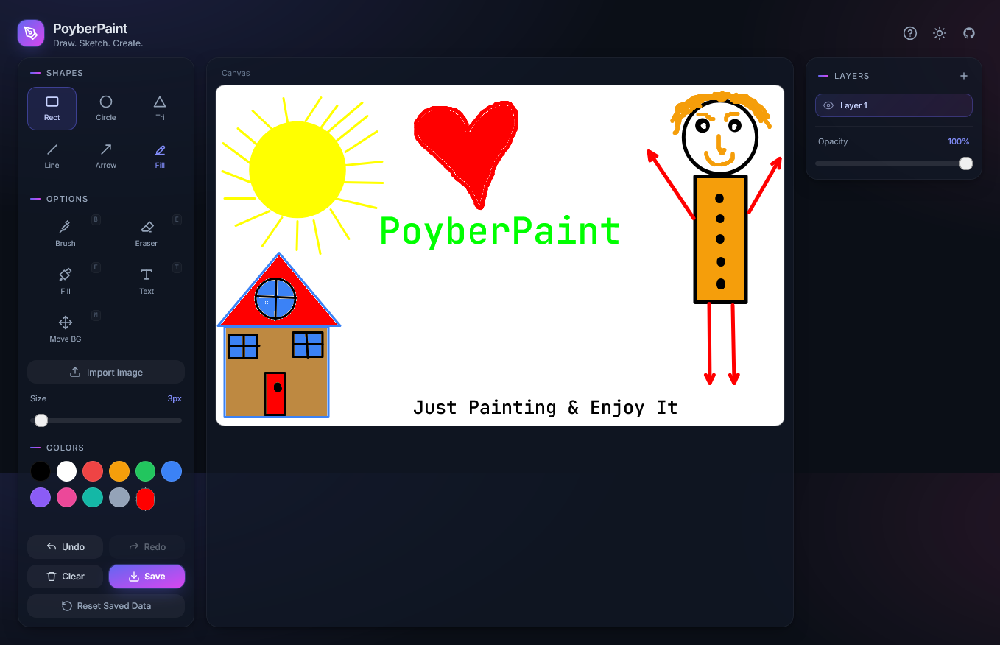
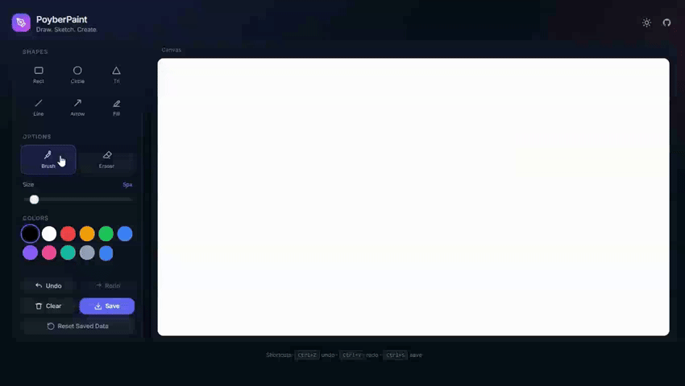

<div align="center">



<br />
<br />

# 🎨 PoyberPaint

**A modern, lightweight paint & drawing web app — right in your browser.**

Draw. Sketch. Create.

<br />

[](https://ashkanpoyber.github.io/PoyberPaint/)
[](https://developer.mozilla.org/en-US/docs/Web/JavaScript)
[](https://tailwindcss.com/)
[](./LICENSE)
[](https://github.com/ashkanpoyber/PoyberPaint/stargazers)
[](https://github.com/ashkanpoyber/PoyberPaint/releases)

</div>

---

## ✨ Features

### 🎨 Drawing Tools

- 🖌️ **Brush** — smooth freehand drawing
- 🧽 **Eraser** — true transparency with `destination-out`
- ✍️ **Text** — click, type, and place text anywhere
- 📏 **Line** — draw straight lines
- ➡️ **Arrow** — with dynamic arrowhead geometry
- 🔷 **Shapes** — rectangle, circle, triangle
- 🪣 **Flood Fill** — BFS-based bucket tool with anti-alias tolerance

### 🗂️ Layers

- 🎨 **Multi-layer support** — add, delete, duplicate, rename
- 👁️ **Visibility toggle** — hide or show individual layers
- 🎚️ **Opacity slider** — per-layer transparency control
- 🔄 **Active layer switching** — click any layer to make it active
- 💾 **Full persistence** — every layer survives page reloads

### 🖼️ Image Layer

- 📤 **Import** — load JPG, PNG, WebP, or GIF (auto-compressed)
- 🖐️ **Pan** — drag to reposition
- 🔍 **Zoom** — mouse wheel or zoom buttons
- 📐 **Resize** — drag any corner handle
- 🔄 **Rotate** — drag the top handle (hold `Shift` to snap)
- ↔️ **Flip** — horizontal and vertical
- 🎯 **Snap to center** — with visual feedback
- 💾 **Persisted** — transform survives reloads

### ⚡ Experience

- ↩️ **Undo / Redo** — per-layer, with `Ctrl+Z` / `Ctrl+Y`
- 💾 **Export PNG** — merges all visible layers, `Ctrl+S`
- 🌗 **Light / Dark theme** — auto-saved and switchable
- 📱 **Fully responsive** — desktop, tablet, mobile
- 🖱️ **Pointer Events** — mouse, touch, and stylus
- 🖥️ **Retina-ready** — crisp output on high-DPI screens
- ⌨️ **Keyboard shortcuts** — tools, colors, sizes, layers
- 🔔 **Toasts & modals** — clean, modern feedback for every action

---

## 🎬 Demo

<div align="center">



<br />
<br />

👉 **[Try it live →](https://ashkanpoyber.github.io/PoyberPaint/)**

</div>

---

## 🛠️ Tech Stack

|     Layer     | Choice                         |
| :-----------: | :----------------------------- |
|  **Markup**   | HTML5                          |
|  **Styling**  | TailwindCSS (CDN) + custom CSS |
|   **Logic**   | Vanilla JavaScript (ES6+)      |
| **Rendering** | HTML5 Canvas API               |
|   **Icons**   | Inline SVG                     |
|   **Fonts**   | Inter + JetBrains Mono         |
|  **Storage**  | LocalStorage                   |
|  **Hosting**  | GitHub Pages                   |

---

## 🧠 What I Learned

Building PoyberPaint helped me practice:

- 🎨 **Canvas API** — `getImageData`, `putImageData`, paths, transforms, `fillText`
- 🪣 **Flood Fill algorithm** — BFS traversal with anti-alias tolerance
- 🖱️ **Pointer Events** — unified mouse / touch / stylus handling with `setPointerCapture`
- 🖥️ **DPR-aware rendering** — crisp output on retina displays using `devicePixelRatio`
- 📐 **Vector math** — arrowhead geometry via `Math.atan2` and trigonometry
- ✍️ **Hybrid DOM + Canvas** — floating `<input>` for text, committed to canvas
- 🗂️ **Multi-layer architecture** — independent canvases with per-layer state and history
- 💽 **Persistence** — canvas, layers, and settings via `LocalStorage` with graceful fallbacks
- ⏱️ **Debouncing** — smooth canvas resize handling
- 🧩 **Modular architecture** — clean separation of concerns in vanilla JS
- 🌗 **Theming** — dark/light toggle with FOUC prevention
- 🖼️ **Image manipulation** — pan, zoom, resize, and rotate with SVG overlay handles
- 📐 **Transform math** — combining translate, scale, and rotate with correct bounds
- 🎯 **Hit detection** — SVG pointer events on rotated bounding boxes
- ✨ **UX polish** — toasts, modals, loading states, and custom scrollbars

---

## ⌨️ Keyboard Shortcuts

| Shortcut    | Action             |
| :---------- | :----------------- |
| `B`         | Brush              |
| `E`         | Eraser             |
| `T`         | Text               |
| `R`         | Rectangle          |
| `C`         | Circle             |
| `L`         | Line               |
| `A`         | Arrow              |
| `F`         | Fill               |
| `M`         | Move Background    |
| `1` – `9`   | Pick palette color |
| `[` / `]`   | Brush size down/up |
| `0`         | Reset background   |
| `Shift + N` | New layer          |
| `Shift + D` | Duplicate layer    |
| `Esc`       | Close / cancel     |
| `Ctrl + Z`  | Undo               |
| `Ctrl + Y`  | Redo               |
| `Ctrl + S`  | Save as PNG        |

---

## 📦 Getting Started

### Option 1 — Just open it

```bash
git clone https://github.com/ashkanpoyber/PoyberPaint.git
cd PoyberPaint
```

Then open `index.html` in your browser. No build step, no dependencies.

### Option 2 — Local server

```bash
npx serve .
# or
python -m http.server 8000
```

Then visit `http://localhost:8000`.

---

## 📂 Project Structure

```
PoyberPaint/
├── index.html          # Main app markup
├── css/
│   └── style.css       # Custom styles + modals + toasts
├── js/
│   ├── storage.js      # LocalStorage wrapper
│   └── app.js          # Main logic (layers, tools, drawing)
├── assets/
│   ├── favicon.svg
│   ├── preview.png
│   └── demo.gif
├── CONTRIBUTING.md
├── CODE_OF_CONDUCT.md
├── CHANGELOG.md
├── LICENSE
└── README.md
```

---

## 🗺️ Roadmap

- [x] Brush, eraser, shapes
- [x] Line & arrow tools
- [x] Text tool
- [x] Flood fill (bucket)
- [x] Undo / redo
- [x] Save as PNG
- [x] Responsive dark UI
- [x] Light / dark theme toggle
- [x] LocalStorage persistence
- [x] Image import with pan, zoom, resize, rotate
- [x] Layer system
- [x] Modals & toasts for better UX
- [ ] Export to SVG
- [ ] Custom canvas size
- [ ] Gradient tool
- [ ] Background removal

---

## 🤝 Contributing

Contributions, issues, and feature requests are welcome!

Please check the [CONTRIBUTING](./CONTRIBUTING.md) guide before opening a PR, and feel free to open an [issue](https://github.com/ashkanpoyber/PoyberPaint/issues) for any bug or idea.

If you like this project, please consider giving it a ⭐

---

## 📄 License

This project is licensed under the **MIT License** — see the [LICENSE](./LICENSE) file for details.

---

<div align="center">

## 👤 Author

**MohammadReza Dalili (AshkanPoyber)**

[](https://github.com/ashkanpoyber)
[](https://ashkanpoyber.github.io)

<br />

⭐ **If you like this project, give it a star!** ⭐

Made with ❤️ by **AshkanPoyber**

</div>
